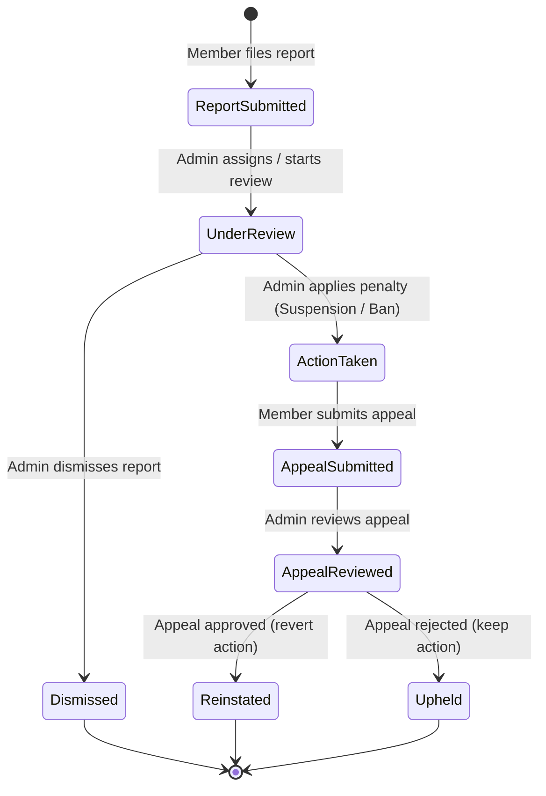

# Social Graph & Moderation Protocol Layer — Specification

**Status:** Proposed / Design Approved  
**Feature Flag:** `NEXT_PUBLIC_FEATURE_PROFILES` (governs profile and social features), and admin moderation flag.  
**Affected Files:** `lib/api/types.ts`, `app/members/[address]/page.tsx`, `app/admin/moderation/page.tsx`

---

## 1. Social Graph Data Model

The social graph handles relationships between community members using a mutual-connection model with bi-directional block capability.

### 1.1 Connection Entity
A relationship between two member addresses is defined as a `Connection`:
- **Mutual Connection**: A connection is bi-directional and must be accepted by both parties. It transitions from a requested status to an accepted status.
- **Directional State (Legacy/Reference)**: While we use a mutual-connection flow, the database representation utilizes explicit directionality to track initiator vs receiver.

```typescript
export type ConnectionStatus = 'pending' | 'accepted' | 'blocked';

export interface Connection {
  id: string;
  fromAddress: string;  // Initiator of the connection or block
  toAddress: string;    // Target of the connection or block
  status: ConnectionStatus;
  createdAt: string;    // ISO 8601
  updatedAt: string;    // ISO 8601
}
```

### 1.2 Block Entity
Blocks are represented as a special connection record with `status: 'blocked'`.
- When Member A blocks Member B, a record is written with `fromAddress: Member A`, `toAddress: Member B`, and `status: 'blocked'`.
- Any existing connection between Member A and Member B is deleted or overwritten by the block record.
- **Bi-directional Hiding**: The protocol layer and profile queries must filter out all data if a block exists in *either* direction (i.e. `(from = A AND to = B) OR (from = B AND to = A)`).

---

## 2. Privacy Rules

Connection visibility is governed by explicit privacy settings stored on each member's profile.

### 2.1 Settings Option
A member can configure their connection list privacy via `ProfilePrivacySetting`:
- `public`: Anyone can view the connection list.
- `mutual-only`: Only other mutual connections of this profile can view the connection list.
- `private`: Only the profile owner can view the connection list.

```typescript
export type PrivacySetting = 'public' | 'mutual-only' | 'private';

export interface MemberPrivacySettings {
  address: string;
  connectionVisibility: PrivacySetting;
}
```

### 2.2 Profile UI Visibility Logic
When Viewer V requests the profile of Member M:
1. **Block check**: If a block exists between Viewer V and Member M (in either direction), return `404 Not Found` (or equivalent error/empty state) for the profile.
2. **Profile data**: Return display name, avatar, bio, and badges.
3. **Connections list**:
   - If Viewer V is Member M (owner): Show connection list.
   - If Member M's setting is `public`: Show connection list.
   - If Member M's setting is `mutual-only` AND Viewer V is a mutual connection (accepted state between M and V): Show connection list.
   - Otherwise: Hide connection list and show a privacy indicator.

---

## 3. Moderation State Machine

The moderation queue handles member reports and appeals. It aligns with the backend workflow deferred in `guildpass-core`.

### 3.1 Lifecycle States



### 3.2 Types Definition
```typescript
export type ModerationState =
  | 'report_submitted'
  | 'under_review'
  | 'action_taken'
  | 'dismissed'
  | 'appeal_submitted'
  | 'appeal_reviewed_reinstated'
  | 'appeal_reviewed_upheld';

export type PenaltyType = 'warning' | 'suspension' | 'permanent_ban';

export interface ModerationReport {
  id: string;
  reporterAddress: string;
  reportedAddress: string;
  reason: string;
  details?: string;
  state: ModerationState;
  penaltyApplied?: PenaltyType;
  appealNotes?: string;
  adminNotes?: string;
  createdAt: string;
  updatedAt: string;
}
```

---

## 4. Abuse-Case Review & Mitigations

### 4.1 Harassment via Public Connection Lists
- **Threat**: Bad actors scrape connection lists to identify high-value targets, build social correlation maps, or harass a member's friends.
- **Mitigation**: Members can switch connection lists to `mutual-only` or `private`. Active blocks prevent the blocked user from obtaining the blocker's connection list, even if it is set to `public`.

### 4.2 Harassment via Outbound/Incoming Requests
- **Threat**: Users receiving unwanted connection requests repeatedly from spam/harassment wallets.
- **Mitigation**:
  1. Once a member blocks another wallet, no requests can be initiated from the blocked wallet.
  2. Rate-limiting is applied to connection requests.
  3. Denying/ignoring a connection request moves it to a silent status rather than notifying the sender.

### 4.3 Summary of Visibility Rules
| View Relationship | Block Active? | Connection Privacy | Connection List Visible? |
|-------------------|---------------|--------------------|--------------------------|
| Self              | No            | Any                | Yes                      |
| Blocked (either)  | Yes           | Any                | No (Profile Hidden)      |
| Mutual Connection | No            | mutual-only / pub  | Yes                      |
| Non-Connection    | No            | public             | Yes                      |
| Non-Connection    | No            | mutual-only        | No                       |
| Anyone            | No            | private            | No                       |
